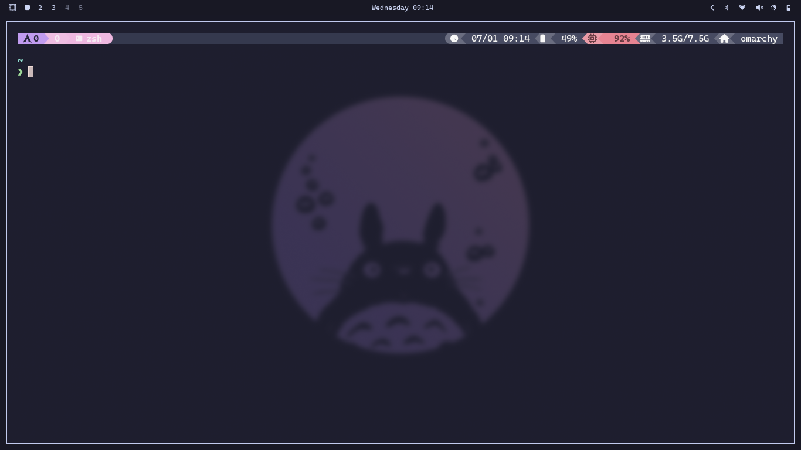
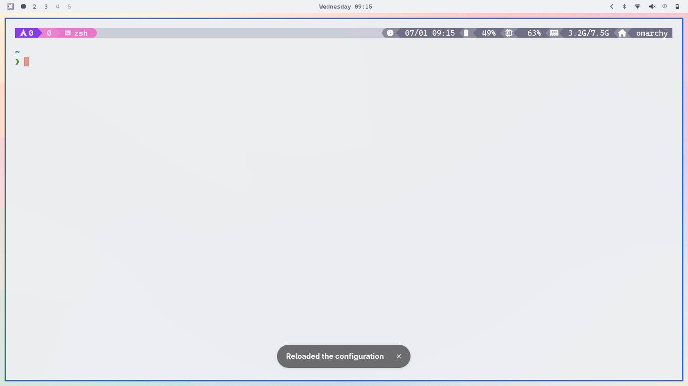
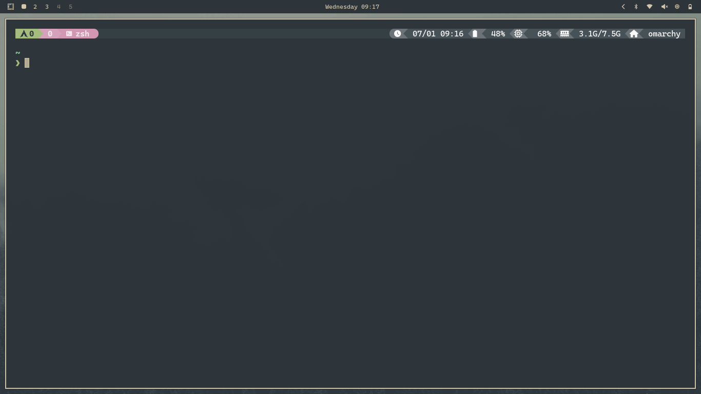
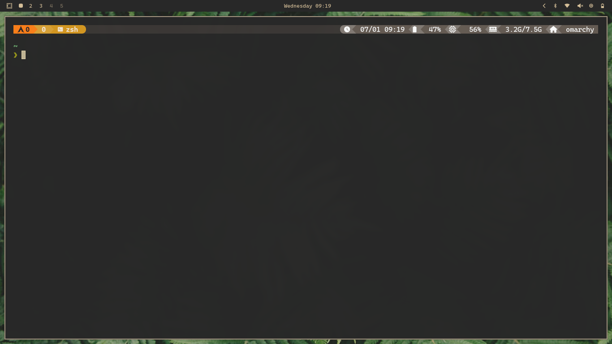
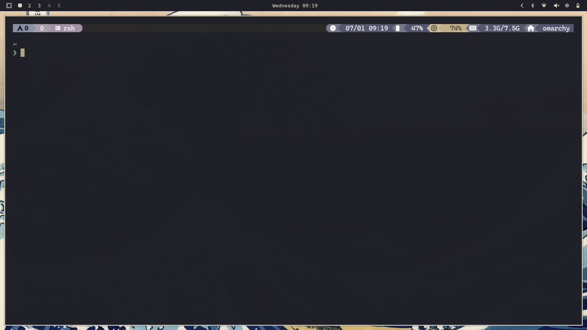
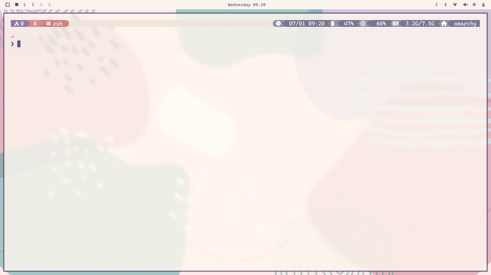
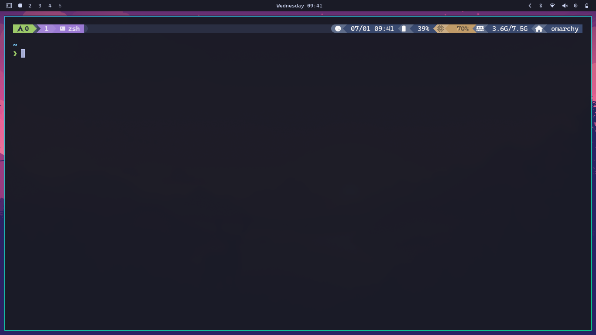

# Omarchy Tmux

<p align="center">
  <a href="https://omarchy.org" target="_blank">
    
  </a>
  <a href="https://github.com/fabioluciano/tmux-powerkit" target="_blank">
    
  </a>
  <a href="https://github.com/joaofelipegalvao/omarchy-tmux/blob/main/LICENSE" target="_blank">
    
  </a>
<a href="https://github.com/joaofelipegalvao/omarchy-tmux/blob/main/docs/INSTALL.md" target="_blank">
    
  </a>
<a href="https://github.com/joaofelipegalvao/omarchy-tmux/blob/main/docs/HOW_IT_WORKS.md" target="_blank">
    
  </a>
  <a href="https://github.com/joaofelipegalvao/omarchy-tmux/releases" target="_blank">
    
  </a>
</p>

<div align="center">
  
**Seamless [tmux-powerkit](https://github.com/fabioluciano/tmux-powerkit) integration for [Omarchy](https://omarchy.org)**

**40+ themes · 60+ variants · Instant switching · Persistent customizations**

  <table>
  <tr>
    <td align="center">
      
      <br/>
      <sub><b>Catppuccin Macchiato</b></sub>
    </td>
    <td align="center">
      
      <br/>
      <sub><b>Catppuccin Latte</b></sub>
    </td>
  </tr>
  <tr>
    <td align="center">
      
      <br/>
      <sub><b>Everforest</b></sub>
    </td>
    <td align="center">
      
      <br/>
      <sub><b>Gruvbox</b></sub>
    </td>
  </tr>
  <tr>
    <td align="center">
      
      <br/>
      <sub><b>Kanagawa</b></sub>
    </td>
    <td align="center">
      
      <br/>
      <sub><b>Nord</b></sub>
    </td>
  </tr>
  <tr>
    <td align="center">
      
      <br/>
      <sub><b>Rose Pine Dawn</b></sub>
    </td>
    <td align="center">
      
      <br/>
      <sub><b>Tokyo Night</b></sub>
    </td>
  </tr>
</table>

<p align="center"><em>tmux updates automatically when switching Omarchy themes with <code>Super + Ctrl + Shift + Space</code></em></p>

</div>

## Overview

**Omarchy Tmux** provides native integration between **Omarchy** and **tmux-powerkit**, enabling tmux to automatically follow Omarchy theme changes while preserving user customizations.

Starting from **v2.1**, the architecture is based on **persistent per-theme profiles**, ensuring that any customization you make is never overwritten or lost when switching themes.

## Features

* 🎨 **40+ themes with 60+ variants** — Full PowerKit theme library
* ⚡ **Instant theme switching** — Automatic reload on Omarchy theme change
* 🔧 **Persistent customizations** — Theme configs are permanent and editable
* 🔗 **Stable architecture** — Static tmux.conf with dynamic profiles
* 📦 **Rich plugin ecosystem** — CPU, memory, battery, git, weather, and more
* 🛡️ **Zero overwrites** — Profiles are generated once and never regenerated

## What’s New in v2.1

v2.1 introduces a **persistent profile architecture**:

* Each theme has its own permanent config file
* Profiles are created once and never overwritten
* Switching themes updates only a symlink
* Customizations persist forever
* Uses Omarchy 3.3+ `theme.name` for reliable detection

> Migrating from v2.0? See the [Migration Guide](/docs/INSTALL.md#migration-from-v20-to-v21)

## Quick Start

### 1. Install

```bash
curl -fsSL https://raw.githubusercontent.com/joaofelipegalvao/omarchy-tmux/main/scripts/omarchy-tmux-install.sh | bash
```

### 2. Inside tmux, install PowerKit

```
prefix + I (Ctrl+b Shift+i)
```

### 3. Switch themes in Omarchy

```
Super + Ctrl + Shift + Space
```

### 4. Customize your theme

```bash
nano ~/.config/tmux/omarchy-current-theme.conf
```

Your changes persist automatically.

## Requirements

* [Omarchy](https://omarchy.org) 3.3+ (hooks support)
* [tmux](https://github.com/tmux/tmux/wiki) 2.9+
* [TPM](https://github.com/tmux-plugins/tpm) (Tmux Plugin Manager)
* git

## How It Works

```
tmux.conf (static)
  ↓
omarchy-current-theme.conf (symlink)
  ↓
omarchy-themes/THEME.conf (persistent profile)
```

**On theme change:**

1. Omarchy updates `theme.name`
2. Hook triggers reload
3. Symlink updates
4. tmux reloads profile

Your customizations are preserved permanently.

See [How It Works](docs/HOW_IT_WORKS.md) for detailed architecture.

## Supported Themes

<details>
<summary><strong>40+ themes with 60+ variants (click to expand)</strong></summary>

**Fully Supported:**

* Catppuccin (latte, macchiato, frappe, mocha)
* Rose Pine (dawn, main, moon)
* Tokyo Night (night, storm, day)
* Gruvbox (dark, light)
* Everforest (dark, light)
* Kanagawa (dragon, lotus)
* Flexoki (light, dark)
* Nord, Dracula, Solarized
* GitHub, Ayu, Material, Monokai
* OneDark, Atom, Cobalt2, Darcula
* Horizon, Iceberg, Kiribyte, Molokai
* Moonlight, Night Owl, Oceanic Next
* Pastel, Poimandres, Slack, Snazzy
* Spacegray, Synthwave, Vesper

**Unsupported (fallback to Tokyo Night):**

* ethereal, hackerman, matte-black, osaka*, ristretto

</details>

## Customization

Each theme has its own config at `~/.config/tmux/omarchy-themes/THEME_NAME.conf`.

### Quick Examples

```bash
# Change plugins
set -g @powerkit_plugins "datetime,battery,cpu,memory,weather,git"

# Change separator style (normal, rounded, flame, pixel, honeycomb)
set -g @powerkit_separator_style "rounded"

# Change update interval
set -g @powerkit_status_interval "5"
```

### Available Plugins

```
datetime, battery, cpu, memory, hostname, disk, load,
git, weather, network, wifi, vpn, bluetooth, volume,
kubernetes, terraform, docker, github, packages, ...
```

**Customizations persist** when switching themes!

See [PowerKit Documentation](https://github.com/fabioluciano/tmux-powerkit) for full options.

## Documentation

* 📚 [Installation Guide](docs/INSTALL.md) — Setup, options, and configuration
* 🔧 [How It Works](docs/HOW_IT_WORKS.md) — Architecture deep dive
* 🐛 [Troubleshooting](docs/TROUBLESHOOTING.md) — Common issues and solutions

## Uninstall

```bash
curl -fsSL https://raw.githubusercontent.com/joaofelipegalvao/omarchy-tmux/main/scripts/omarchy-tmux-uninstall.sh | bash
```

Options:

```bash
-k   Keep profiles
-y   Skip confirmations
-q   Quiet mode
```

## Contributing

Contributions are welcome! Please:

1. Fork the repository
2. Create a feature branch
3. Test thoroughly
4. Submit a pull request with clear description

**Report issues**: Include Omarchy version, tmux version, current theme, and error messages.

## Acknowledgments

* [@dhh](https://github.com/dhh) — [Omarchy](https://omarchy.org)
* [@fabioluciano](https://github.com/fabioluciano) — [tmux-powerkit](https://github.com/fabioluciano/tmux-powerkit)
* [@bruno-](https://github.com/bruno-) — [TPM](https://github.com/tmux-plugins/tpm)
* All contributors and users who provided feedback

<div align="center">

**[Omarchy](https://omarchy.org)** · **[PowerKit](https://github.com/fabioluciano/tmux-powerkit)** · **[Issues](https://github.com/joaofelipegalvao/omarchy-tmux/issues)**

Made with ❤️ for Omarchy users

⭐ Star this repo if you find it useful!

</div>
